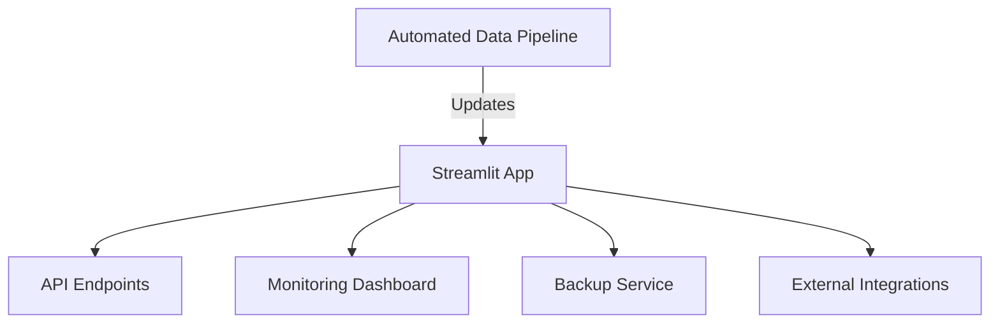

# Deployment Architecture

## Overview

This project uses a modular deployment architecture designed for scalability, security, and ease of integration.

### Components

- **Data Pipeline:** Automated ETL scripts fetch, clean, and update datasets regularly.
- **Application Hosting:** Deployed on Streamlit Cloud with GitHub Actions for CI/CD.
- **API Layer:** REST and WebSocket endpoints provided for integration with external systems.
- **Security:** All secrets are managed via environment variables and GitHub Secrets.
- **Monitoring:** Resource usage and application health are tracked through a custom dashboard.
- **Backup:** Daily backups to secure cloud storage with disaster recovery procedures.

### Diagram

## Deployment Steps

1. **CI/CD Workflow:** Automated testing and deployment via GitHub Actions.
2. **Environment Setup:** Use environment variables for sensitive configuration.
3. **Monitoring & Alerts:** Set up monitoring and email/SMS alerts for failures.
4. **Disaster Recovery:** Backup scripts run nightly, with restore instructions documented.

---